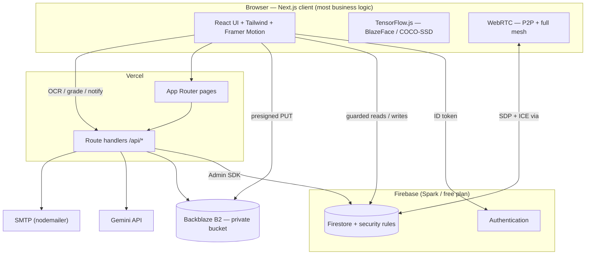
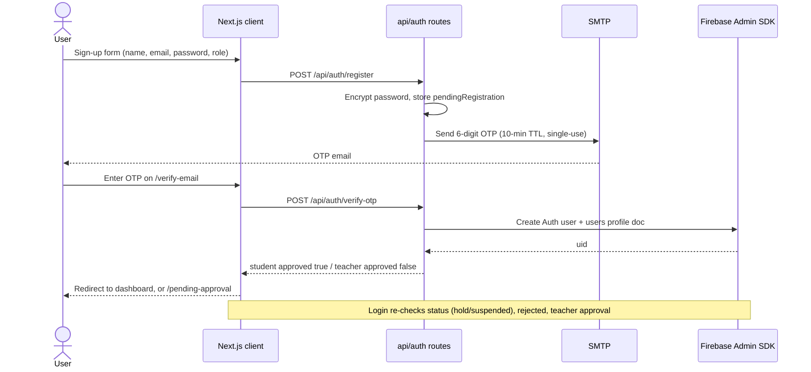
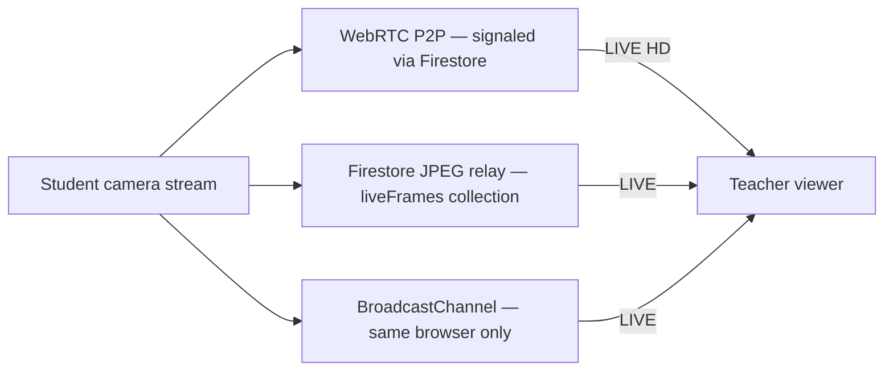
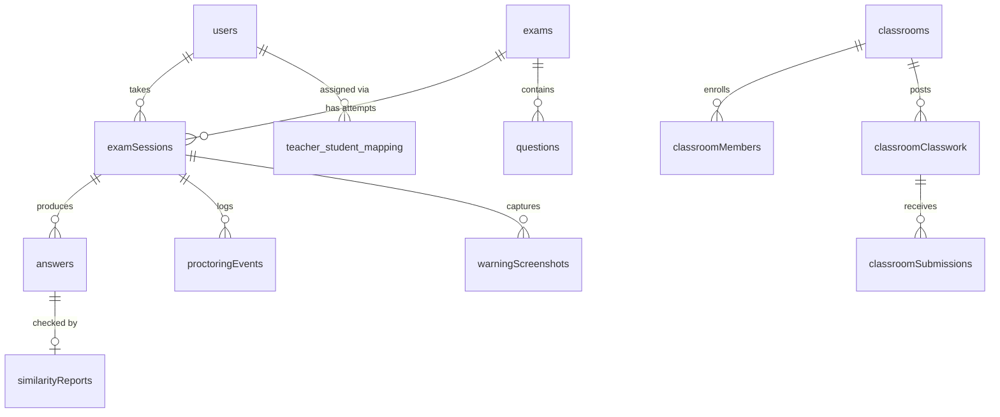

<div align="center">

# 🌿 GreenGuardian

### AI-powered online exam proctoring & academic-management platform

Run webcam-monitored online exams with real-time AI proctoring, grade and review
submissions, catch plagiarism, and manage classrooms, notices, results and live
video meetings — on a **serverless stack** with **no media server** and **no
Cloud Functions**.

<p>
  
  
  
  
  
  
</p>

<p>
  
  
  
  
</p>

[Features](#-feature-tour) · [Architecture](#-architecture) · [Quick start](#-quick-start) · [Env vars](#-environment-variables) · [Deployment](#-deployment) · [Docs](#-documentation)

</div>

> **Live demo:** _add your deployment URL here_ · **Firebase project:** `greenguardian2026`

---

## 📑 Table of contents

- [What it is](#-what-it-is)
- [Highlights](#-highlights)
- [Roles](#-roles)
- [Feature tour](#-feature-tour)
- [Architecture](#-architecture)
- [Authentication flow](#-authentication-flow)
- [Live proctoring transports](#-live-proctoring-transports)
- [Data model](#-data-model)
- [Tech stack](#-tech-stack)
- [Project structure](#-project-structure)
- [Quick start](#-quick-start)
- [Environment variables](#-environment-variables)
- [npm scripts](#-npm-scripts)
- [Application routes](#-application-routes)
- [Testing](#-testing)
- [Deployment](#-deployment)
- [Documentation](#-documentation)
- [Security notes](#-security-notes)
- [Known limitations](#-known-limitations)
- [Contributing](#-contributing)
- [Contributors](#-contributors)
- [License](#-license)
- [Acknowledgments](#-acknowledgments)

---

## 🧭 What it is

GreenGuardian is a **proctored online exam system** with a full academic layer
around it — classrooms, notices, results, assignments and video meetings. One
Next.js app serves three roles, and it runs on Firebase's **free (Spark) plan**
plus a **private Backblaze B2 bucket** for files.

There is **no custom backend server.** A handful of Vercel route handlers under
`app/api/*` cover the few things that must run server-side — OTP email, the
Gemini OCR proxy, storage signing, notification fan-out. Everything else is
browser logic, and **authorization is enforced by Firestore security rules**
(`firestore.rules`), not middleware.

---

## ✨ Highlights

| | |
| --- | --- |
| 🎥 **Real-time AI proctoring** | BlazeFace face detection, COCO-SSD phone/object detection, gaze tracking, tab-switch & fullscreen-exit logging — all in-browser with TensorFlow.js |
| 📊 **Behavior & risk scoring** | Weighted, with diminishing returns for repeats; a configurable warning ceiling drives auto-submit; every violation captures a **permanent** screenshot |
| 👀 **Watch Live** | Teacher sees a student's webcam over WebRTC P2P, with an automatic Firestore JPEG frame-relay fallback — no VPS, no SFU, identical on localhost and Vercel |
| 🤖 **AI-assisted grading & plagiarism** | Gemini OCR reads uploaded PDFs/images, flags likely AI-generated text, and suggests marks a teacher finalizes; cross-student similarity with clear thresholds |
| 🏫 **Classroom module** | Google-Classroom-style Stream / Classwork / People / About, join-by-code, submissions, email + in-app fan-out |
| 📹 **Green Room** | Scheduled, passcode-protected full-mesh WebRTC meetings with chat, reactions and moderation |
| 🔐 **Account lifecycle** | OTP email verification, self-service password reset, admin **Hold / Suspend / Activate** that signs a user out live |
| 🎯 **Assignment scoping** | A teacher's notices, exams and classrooms only reach students an admin assigned to them — **fails closed** |

---

## 👥 Roles

| Role | Access |
| --- | --- |
| **🎓 Student** | Take proctored exams, review own results, join classrooms, read notices, join Green Room meetings |
| **🧑‍🏫 Teacher** *(admin approval required)* | Create & edit exams, monitor sessions live, grade with AI assistance + feedback, run classrooms, post notices, schedule meetings |
| **🛡️ Admin** | Manage all users, approve teachers, assign students to teachers, manage the academic catalog, tune global settings, watch System Health |

---

## 🚀 Feature tour

<details open>
<summary><b>1. 🔑 Authentication &amp; onboarding</b></summary>

- Email + password sign-up with **6-digit OTP email verification** — 10-minute
  expiry, single-use, 60-second resend cooldown. The account is created
  server-side **only after** the OTP is verified.
- Students are auto-approved; **teachers land on `/pending-approval`** until an
  admin approves them.
- Self-service **password reset**, in-app password change, and an admin-issued
  temporary password that forces a change on next login.
- **Account status** — `active` / `hold` / `suspended`. Set by an admin, blocks
  login, and a live `onSnapshot` on the user's own document signs them out
  instantly if it changes mid-session.
</details>

<details>
<summary><b>2. 🎥 AI proctored exams</b></summary>

- Pre-exam countdown, exam-duration timer, and **answer autosave every 15 s**
  (restored on resume — a refresh no longer loses work or resets the clock).
- **Tab / window switch detection** and **fullscreen enforcement** with exit
  logging.
- **Face detection** (BlazeFace) — flags missing face and multiple faces.
- **Phone & object detection** (COCO-SSD) — flags phones and other devices.
- **Gaze / attention-away** tracking with a per-exam tolerance.
- **Behavior score** (starts at 100) with per-type weights and diminishing
  returns; **practical cheating score** with `low / medium / high / critical`
  risk levels and a per-type breakdown.
- Admin-configured **`maxWarnings`** ceiling drives auto-submit; each warning
  writes a permanent webcam screenshot to `warningScreenshots`.
</details>

<details>
<summary><b>3. 👀 Live monitoring</b></summary>

- **Watch Live** — WebRTC peer-to-peer video, **one connection per watching
  teacher**, signalled through Firestore; a **JPEG frame-relay** fallback
  (`liveFrames/{sessionId}`) when P2P can't connect; BroadcastChannel for two
  tabs on one machine. The badge shows the real transport: `LIVE HD` / `LIVE` /
  `Snapshot` / `Offline`.
- Frame rate is throttled by what the teacher is looking at (grid vs
  fullscreen) and drops to a 15 s heartbeat once WebRTC connects — designed to
  stay inside the Firestore free tier.
- **Snapshots gallery** — every captured warning screenshot, organised
  **Student → Exam → Snapshot**, searchable, with view / download / delete.
</details>

<details>
<summary><b>4. 📝 Exam lifecycle</b></summary>

- Teachers build exams with **MCQ, short-answer, long-answer and code**
  questions, optional **negative marking**, per-question marks, shuffle, and a
  rich settings object (webcam required, tab-switch allowance, face tolerance,
  late-submission window, review permissions…).
- **OCR-assisted question extraction** — upload a question-paper PDF and Gemini
  drafts the questions.
- **Attempt limits** — `attemptsAllowed` per exam, enforced **server-side** via
  a Firestore transaction + `examAttemptCounters/{examId}_{studentId}` so a
  crafted client can't exceed the cap.
- **Suspend / resume** — a teacher freezes a student's in-progress attempt; the
  countdown pauses and `totalPausedMs` is credited back on resume.
</details>

<details>
<summary><b>5. 🧮 Grading &amp; results</b></summary>

- **AI mark suggestions** (Gemini) that a teacher reviews and accepts or
  replaces — the suggestion is kept separate from the final mark so an override
  is visible as an override. Plus a manual evaluation panel.
- Per-question marks obtained, negative marks, **teacher feedback**, computed
  **grade** and **percentage**, submission time.
- One shared question-by-question **review renderer** (`ExamAnswerReview`) used
  by both the student's own review page and the teacher's per-session review.
- Published gradebook **results** and academic **warnings** (attendance, low
  GPA, failed subject…), distinct from proctoring warnings.
</details>

<details>
<summary><b>6. 🔍 Plagiarism &amp; answer verification</b></summary>

- **OCR** text extraction from uploaded PDFs/images via Gemini Vision, with word
  count and confidence.
- **AI-generated-content detection** with a confidence score and indicators.
- **Cross-student similarity** scoring (in-repo cosine / n-gram — no external
  service). Thresholds:

  | Score | Verdict |
  | --- | --- |
  | ≥ 70 % | `plagiarized` |
  | 30 – 69 % | `partial` |
  | < 30 % | `unique` |
</details>

<details>
<summary><b>7. 📈 Analytics</b></summary>

Exam improvement trend, behavior-score history, marks trend, class comparison,
and clean-vs-suspicious session ratio — `lib/analytics/exam-analytics.ts` +
`components/analytics/Charts.tsx`, on both the teacher and admin dashboards.
</details>

<details>
<summary><b>8. 📢 Notices &amp; notifications</b></summary>

- Teacher-authored announcements with optional attachment / external link,
  **scoped to assigned students**, with read receipts.
- Publishing fans a notice out to **in-app notifications** and **email**
  (retried up to 3×, with a per-recipient delivery log).
- Targeting: `all / course / batch / section / semester / individual`.
- _No social-media integration and no external scraping_ — notices are authored
  in-app.
</details>

<details>
<summary><b>9. 🏫 Classroom module</b></summary>

- Google-Classroom-style, teacher-owned classrooms with a unique 6-character
  **join code** / invite link and **Stream / Classwork / People / About** tabs.
- Classwork types: `assignment / quiz / material / resource / link`, draft or
  published, with due dates and total marks.
- Student **submissions** (text, files, or both), late-flagged against the due
  date, with teacher marks + feedback and an optional AI pre-pass.
- A student can only **join** if the classroom's teacher is in that student's
  `assignedTeacherIds` — enforced client-side **and** in `firestore.rules`.
  Deleting a classroom cascades to its posts / classwork / comments / members.
</details>

<details>
<summary><b>10. 📹 Green Room (video meetings)</b></summary>

- Scheduled, **passcode-protected** meetings using **full-mesh WebRTC**
  (default cap ~8 video participants, ~16 audio-only — configurable).
- In-meeting chat, reactions, participants panel, host **moderation**
  (mute / remove).
- Passcode hashes live in a collection the client rules deny entirely — only the
  Admin SDK reads them. Optional TURN for participants behind strict NATs.
</details>

<details>
<summary><b>11. 🎯 Teacher ↔ student assignment</b></summary>

- An admin assigns **Course + Batch + Section** (or an explicit student list) to
  a teacher; the result is denormalized onto each student as
  `assignedTeacherIds`, with an immutable `assignmentHistory` audit trail.
- Notices, notifications, exam listings and classroom joins all filter against
  this list — **fails closed**: an unassigned student sees nothing from any
  teacher. Run **"Sync Assignment Visibility"** (Admin → Assignments) once after
  deploying to backfill older assignments.
</details>

<details>
<summary><b>12. 🎓 Academic catalog</b></summary>

Admin-managed **departments, batches and sections** (global, deterministic
document IDs so seeding is idempotent) and **courses** —
`lib/academics/catalog.ts`, `app/dashboard/admin/academics`.
</details>

<details>
<summary><b>13. 🛡️ Admin &amp; operations</b></summary>

User management, teacher approval, account status, teacher assignments,
academics, exam oversight, **global settings** (site config, proctoring
`maxWarnings`, risk thresholds), and a **System Health** dashboard reporting
Firebase, B2 reachability, CORS status, email delivery, capability flags, module
counts and a recent server-log ring buffer.
</details>

<details>
<summary><b>14. 🪣 File storage</b></summary>

All uploads (exam papers, answers, classroom materials up to 100 MB, avatars,
proctoring evidence) go to a **private Backblaze B2 bucket** over the S3 API.
Browser uploads use **presigned PUT** URLs from `/api/storage/upload-url`;
stored links are **signed capability URLs** resolved by `/api/storage/download`.
Per-prefix write rules live in `lib/storage/policy.ts` — the direct replacement
for a Firebase `storage.rules` file.
</details>

---

## 🧩 Architecture



- **No session cookie.** `contexts/AuthContext.tsx` mirrors
  `onAuthStateChanged` into React state with a short localStorage cache to
  avoid a loading flash, and watches the signed-in user's own document for
  live status changes.
- **Authorization is Firestore security rules.** Role checks (`isAdmin()`,
  `isTeacher()`, `isStudent()`) `get()` the requester's own `users/{uid}`
  document. File access is enforced by the `/api/storage/*` routes because the
  B2 bucket has no client-side rules layer.
- **Grading runs in the browser** today — a known trust boundary, see
  [Known limitations](#-known-limitations).
- **Free-plan compatible** — no Cloud Functions; `jspdf` roster/paper export
  runs client-side.

---

## 🔐 Authentication flow



Without SMTP configured, the OTP is printed to the server console — fine for
local development. Without Firebase Admin SDK credentials, every server route
returns `503` and `GET /api/auth/config-check` tells you exactly what's missing.

---

## 🎥 Live proctoring transports

Three layered transports; the teacher UI shows whichever is alive. WebRTC costs
**zero** Firestore writes once connected — the relay is a fallback, not the
primary path.



| Condition | Frame interval |
| --- | --- |
| No teacher watching | **no writes at all** |
| Grid tile watching | 2.5 s @ 320 px |
| Fullscreen / detail | 1.0 s @ 480 px |
| WebRTC connected for all viewers | 15 s heartbeat only |

Optionally set `NEXT_PUBLIC_TURN_*` to give the ~10–20 % of students behind
symmetric NATs full-rate P2P instead of the relay. Full design notes:
[`docs/EXAM_SYSTEM_ANALYSIS.md`](docs/EXAM_SYSTEM_ANALYSIS.md).

---

## 🧬 Data model

Core exam-flow collections (all defined in [`lib/types/index.ts`](lib/types/index.ts)):



<details>
<summary><b>All Firestore collections</b></summary>

| Collection | Purpose |
| --- | --- |
| `users` | Profile + `role` / `approved` / `rejected` / `status` / `assignedTeacherIds` / academic fields |
| `pendingRegistrations` | Server-only OTP staging (client `read/write: false`) |
| `exams`, `questions` | Exam metadata + embedded `questions[]`, kept in sync with the standalone collection |
| `examSessions` | One doc per attempt — status, warnings, `locked` / `totalPausedMs`, `attemptNumber`, autosaved answers |
| `examAttemptCounters` | `{examId}_{studentId}` → `count`; backs the server-side attempt-limit rule |
| `answers` | Submitted answers / files, grading summary, OCR + similarity results, teacher feedback |
| `similarityReports` | Plagiarism detection results |
| `examLogs`, `proctoringEvents`, `proctoringSnapshots`, `warningScreenshots` | Proctoring telemetry; `warningScreenshots` is the **permanent** evidence store |
| `liveVideoSignaling`, `liveFrames` | WebRTC signaling + Firestore frame-relay fallback |
| `settings` | `settings/global` — site config, `proctoring.maxWarnings`, risk thresholds |
| `courses`, `batches`, `sections` | Academic catalog (admin-managed) |
| `results`, `studentWarnings`, `resultNotifications` | Published gradebook + academic warnings |
| `notices`, `noticeReads`, `notifications` | Announcements, read receipts, per-user notification fan-out — all assignment-scoped |
| `teacher_assignments`, `teacher_student_mapping`, `assignmentHistory` | Admin-managed teacher↔student assignment source of truth + audit trail |
| `classrooms`, `classroomMembers` | Classroom + joined students (deterministic member doc id) |
| `classroomPosts`, `classroomComments` | Stream tab: announcements / notices / materials + threaded comments |
| `classroomClasswork`, `classroomSubmissions` | Classwork tab + per-student submissions (deterministic submission doc id) |
| `classroomEmailLogs` | Per-recipient email delivery log |
| `greenRoomMeetings`, `greenRoomSecrets`, `greenRoomParticipants`, `greenRoomSignals`, `greenRoomMessages`, `greenRoomReactions` | Green Room meetings, passcode hashes (Admin-SDK only), presence, mesh signaling, chat, reactions |
| `teacherApplications` | Legacy/optional teacher-application flow |

</details>

---

## 🧱 Tech stack

| Layer | Choice |
| --- | --- |
| **Framework** | Next.js 16 (App Router) + React 18, TypeScript 5 — Turbopack in dev, Webpack for `build` |
| **Styling / UI** | Tailwind CSS 3, Radix UI primitives (shadcn-style components in `components/ui`), Framer Motion, `lucide-react`, Inter (`next/font`) |
| **Auth & DB** | Firebase Authentication + Cloud Firestore (Spark / free plan) |
| **Server** | Vercel route handlers using the Firebase Admin SDK (`serverExternalPackages: nodemailer, firebase-admin`) |
| **File storage** | Backblaze B2 (private bucket, S3 API) via `@aws-sdk/client-s3` + `s3-request-presigner` |
| **On-device ML** | TensorFlow.js — `@tensorflow-models/blazeface` (faces), `@tensorflow-models/coco-ssd` (phones / objects) |
| **AI (server)** | Google Gemini (`@google/generative-ai`) — OCR, AI-content detection, mark suggestions, via `/api/ocr` |
| **Text similarity** | In-repo cosine / n-gram (`lib/utils/similarity.ts`, `lib/utils/text-similarity.ts`) — no external service |
| **PDF export** | `jspdf` + `jspdf-autotable` (client-side rosters and papers) |
| **Email** | `nodemailer` (SMTP) with a dev console fallback |
| **Real-time video** | Browser WebRTC (P2P + full mesh) with a Firestore frame / signaling relay — no media server |
| **Testing** | Vitest (`tests/**/*.test.ts`, node environment) |
| **Hosting** | Vercel (app + route handlers); Firebase CLI for rules / indexes; optional Firebase Hosting static export |

---

## 📁 Project structure

```
app/
  api/                      Vercel route handlers — auth, ocr, plagiarism, storage,
                            exams, classroom, notices, greenroom, proctoring, admin
  dashboard/
    admin/                  Academics · Courses · Teachers · Students · Assignments ·
                            Exams · Analytics · System Health · Settings
    teacher/                Classrooms · Green Room · Courses · Exams · Notices ·
                            Submissions & OCR · Watch Live · Snapshots · Students · Analytics
    student/                Dashboard · Classrooms · Green Room · Results · Notices
  exam/[id]/                Proctored exam flow (self-guards auth, outside DashboardLayout)
    review/                 Student's own submission review
  green-room/[code]/        Meeting room (self-guarded)
  classroom/join/           Invite-link landing
  login/ register/ verify-email/ forgot-password/ pending-approval/ profile/
components/
  ui/                       Radix / shadcn primitives
  layouts/DashboardLayout   Role-based sidebar nav + shell
  classroom/  greenroom/  analytics/  admin/  home/  + shared widgets
contexts/AuthContext.tsx    Client auth state + live status watch
hooks/                      useAuth · useCameraPermission · useAcademicCatalog
lib/
  firebase/                 Firestore / Auth read-write functions, one file per domain
  storage/                  Backblaze B2 client uploader, server SDK, key policy, link signing
  services/                 proctoring.ts (warnings, snapshots, suspend/resume), liveVideo.ts (P2P)
  greenroom/                Mesh / signaling / pairing / permissions / codes
  academics/                Department / batch / section / course catalog
  analytics/                Exam analytics aggregation
  email/                    nodemailer sender + HTML templates
  utils/                    Pure logic — validation, behavior scoring, question types, similarity
  types/index.ts            All shared TypeScript interfaces
scripts/                    One-off admin / seed / migration scripts (run manually)
docs/                       Architecture + audit + limitations reference
firestore.rules             The real authorization layer
firestore.indexes.json      Composite indexes
```

---

## ⚡ Quick start

### Prerequisites

- **Node.js 20+** (or **Bun 1.1+**)
- A **Firebase** project with Authentication + Firestore enabled
- A **private Backblaze B2** bucket ([`docs/STORAGE_B2.md`](docs/STORAGE_B2.md))
- A **Google Gemini** API key (for OCR / AI features)
- An SMTP account (optional locally — OTPs print to the console without it)
- A modern browser with webcam access
- Java (only if you want to run the Firestore **emulator**)

### 1 · Clone & install

```bash
git clone https://github.com/BakulBd/GreenGuardian.git
cd GreenGuardian

bun install       # or: npm install
```

### 2 · Configure environment

```bash
cp .env.example .env.local
# then fill in .env.local — see the table below

npm run setup:email                          # status report for the server-side vars
```

At minimum you need the `NEXT_PUBLIC_FIREBASE_*` client config, a Firebase Admin
SDK credential, and the `B2_*` bucket credentials.

### 3 · One-time Firebase & storage setup

```bash
npm run firebase:login
npm run firebase:use                         # selects greenguardian2026
npm run firebase:deploy:rules                # deploy firestore.rules + indexes  (REQUIRED)
npm run storage:cors                         # apply B2 bucket CORS for direct browser uploads
npm run storage:cors:show                    # verify (warns if the bucket is not private)
```

> ⚠️ `firebase:deploy:rules` is **not** run by a code deploy. Several past
> "permission denied" reports were just an un-redeployed ruleset.

### 4 · Create the first admin

```bash
# Register a normal account through the app first, then:
npm run bootstrap:admin
```

…or in the Firebase console set that user's `users/{uid}` document to
`role: "admin"`, `approved: true`.

### 5 · Run

```bash
bun dev            # or: npm run dev   →   http://localhost:3000
```

```bash
npm run build      # next build --webpack
npm start
```

### Optional · fully offline dev (Firebase emulators)

```bash
npm run emulators                            # Auth :9099 + Firestore :8080 + UI :4000  (needs Java)
# set USE_FIREBASE_EMULATOR=true and NEXT_PUBLIC_USE_FIREBASE_EMULATOR=true in .env.local
```

---

## 🔑 Environment variables

Full inline notes are in [`.env.example`](.env.example) and
[`.env.local.example`](.env.local.example). **Nothing server-side may use a
`NEXT_PUBLIC_` prefix** — that inlines secrets into the browser bundle.

| Variable | Required | Purpose / consequence if missing |
| --- | :---: | --- |
| `NEXT_PUBLIC_FIREBASE_API_KEY` · `_AUTH_DOMAIN` · `_PROJECT_ID` · `_MESSAGING_SENDER_ID` · `_APP_ID` · `_MEASUREMENT_ID` | ✅ | Firebase web client config (public by design) |
| `FIREBASE_SERVICE_ACCOUNT` *(or `FIREBASE_SERVICE_ACCOUNT_PATH`, `serviceAccountKey.json`, `GOOGLE_APPLICATION_CREDENTIALS`)* | ✅ | Firebase Admin SDK. **Without it every server route returns 503** |
| `B2_ENDPOINT` · `B2_REGION` · `B2_KEY_ID` · `B2_APPLICATION_KEY` · `B2_BUCKET_NAME` | ✅ for uploads | Private Backblaze B2 bucket (server-only) |
| `STORAGE_URL_SECRET` | ➕ recommended | Signs durable download links; without it, rotating `B2_APPLICATION_KEY` breaks every stored attachment URL |
| `REGISTRATION_ENC_KEY` | ➕ recommended | AES-256-GCM key for pending passwords during the OTP flow — `openssl rand -hex 32` |
| `SMTP_HOST` · `SMTP_PORT` · `SMTP_SECURE` · `SMTP_USER` · `SMTP_PASS` · `MAIL_FROM` | ➕ recommended | Real email delivery. **Silent** — without SMTP, OTP / reset codes are only logged to the server console |
| `GEMINI_API_KEY` | for AI | Server-only. **Silent** — OCR, AI-content detection and AI mark suggestions stop; the buttons stay visible and fail |
| `NEXT_PUBLIC_TURN_URLS` · `_USERNAME` · `_CREDENTIAL` | optional | TURN for Watch Live / Green Room participants behind strict NATs |
| `NEXT_PUBLIC_GREENROOM_MAX_PARTICIPANTS` | optional | Override the full-mesh cap (default `8`) |
| `CONFIG_CHECK_TOKEN` | optional | Gates `/api/auth/config-check` in production (404 without it) |
| `B2_CORS_ORIGINS` | optional | Override the origins written by `npm run storage:cors` |
| `USE_FIREBASE_EMULATOR` · `NEXT_PUBLIC_USE_FIREBASE_EMULATOR` | optional | Local Firebase emulator mode |
| `STATIC_EXPORT` | optional | `true` → `output: "export"` for Firebase Hosting static builds |

---

## 📜 npm scripts

| Script | Does |
| --- | --- |
| `dev` | Next.js dev server (Turbopack) |
| `build` | Production build — `next build --webpack` |
| `start` | Serve the production build |
| `lint` · `typecheck` | ESLint over `.ts` / `.tsx` · `tsc --noEmit` |
| `test` · `test:watch` | Vitest (`tests/**/*.test.ts`) |
| `firebase:login` · `firebase:use` | Firebase CLI auth · select project |
| `firebase:deploy:rules` | Deploy `firestore.rules` + `firestore.indexes.json` |
| `firebase:deploy:hosting` · `firebase:deploy:all` | Deploy static-export hosting · everything |
| `emulators` | Firebase Auth + Firestore emulators |
| `storage:cors` · `storage:cors:show` | Apply · inspect the B2 bucket CORS rule |
| `bootstrap:admin` | Promote an existing account to admin |
| `setup:email` | Report which OTP / server-side env vars are present |
| `seed:defaults` · `seed:all` | Seed Firestore with default · full sample data |
| `backfill:access` · `migrate:answer-keys` | Classroom-access backfill · one-off answer-key migration |

`scripts/` also contains `doctor.mjs`, `migrate-catalog.mjs`, `seed-firestore.mjs`
and `update-admin-uid.mjs` — run directly with `node`.

---

## 🚦 Application routes

### Public
`/` · `/login` · `/register` · `/verify-email` · `/forgot-password` ·
`/pending-approval` · `/classroom/join` · `/green-room/[code]`

### Authenticated (all roles)
`/profile`

### 🎓 Student
`/dashboard/student` · `/dashboard/student/classrooms` *(+ `/[id]`)* ·
`/dashboard/student/green-room` · `/dashboard/student/results` *(+ `/[id]`)* ·
`/dashboard/student/notices` *(+ `/[id]`)* · `/exam` · `/exam/[id]` ·
`/exam/[id]/review`

### 🧑‍🏫 Teacher *(requires admin approval)*
`/dashboard/teacher` · `/dashboard/teacher/classrooms` *(+ `/[id]`)* ·
`/dashboard/teacher/green-room` *(+ `/[id]`)* · `/dashboard/teacher/courses` ·
`/dashboard/teacher/exams` *(+ `/create`, `/[id]`, `/[id]/edit`)* ·
`/dashboard/teacher/notices` *(+ `/create`, `/[id]`, `/[id]/edit`)* ·
`/dashboard/teacher/answers` · `/dashboard/teacher/watch-live` ·
`/dashboard/teacher/snapshots` · `/dashboard/teacher/session-results` ·
`/dashboard/teacher/students` · `/dashboard/teacher/analytics`

### 🛡️ Admin
`/dashboard/admin` · `/dashboard/admin/academics` · `/dashboard/admin/courses` ·
`/dashboard/admin/teachers` · `/dashboard/admin/students` ·
`/dashboard/admin/assignments` ·
`/dashboard/admin/exams` *(+ `/create`, `/[id]`, `/[id]/edit`)* ·
`/dashboard/admin/analytics` · `/dashboard/admin/health` ·
`/dashboard/admin/settings`

### 🔌 API (Vercel route handlers)
`POST /api/auth/register` · `/api/auth/verify-otp` · `/api/auth/resend-otp` ·
`/api/auth/forgot-password` · `/api/auth/placements` ·
`GET /api/auth/config-check` · `POST /api/ocr` · `/api/plagiarism/check` ·
`/api/storage/upload-url` · `/api/storage/upload` · `/api/storage/download` ·
`/api/storage/object` · `/api/exams/evaluate` · `/api/exams/grade` ·
`/api/exams/notify` · `/api/exams/paper` · `/api/classroom/notify` ·
`/api/classroom/sync-access` · `/api/notices/notify` ·
`/api/greenroom/meetings` *(+ `/[id]`)* · `/api/greenroom/join` ·
`/api/greenroom/leave` · `/api/greenroom/moderate` ·
`/api/proctoring/snapshots` · `/api/admin/health` · `/api/admin/logs` ·
`/api/admin/students` · `/api/admin/roster/sync` · `/api/admin/reset-password`

---

## 🧪 Testing

```bash
npm run typecheck   # tsc --noEmit
npm run lint        # eslint
npm test            # vitest
npm run build       # production build
```

Vitest suites in [`tests/`](tests) cover behavior & practical-cheating scoring,
grading, form validation, text similarity, live-video transport selection,
Green Room codes / pairing / permissions, notice targeting, roster matching,
storage-security policy, exam analytics, the serial queue, and API auth errors.

---

## 🚢 Deployment

Primary target is **Vercel** for the app + route handlers, with the **Firebase
CLI** for rules and indexes. Full checklist and per-variable failure modes:
[`docs/PRODUCTION_DEPLOY.md`](docs/PRODUCTION_DEPLOY.md).

1. Set every required [environment variable](#-environment-variables) in
   **Vercel → Settings → Environment Variables**.
   `NEXT_PUBLIC_FIREBASE_STORAGE_BUCKET` is **not** used — file storage is B2.
2. `npm run firebase:deploy:rules` — **required after any change** to
   `firestore.rules`; a code deploy does not do this.
3. `npm run storage:cors` — enables direct browser → B2 uploads. Without it,
   uploads route through the server proxy and are capped at 4 MB, so large
   classroom files fail. The bucket must be **private** (`allPrivate`).
4. Sign in as an admin, open **Dashboard → System Health**, and confirm every
   panel is green. Then click **"Sync Assignment Visibility"** on
   **Admin → Assignments** once.
5. Walk one path of each kind: student joins a classroom by code · student
   submits an assignment with a PDF · student triggers an exam warning → the
   screenshot appears in Teacher → Snapshots · teacher marks an upload-mode
   submission → the mark shows on the student's results.

**Static export (optional):** `STATIC_EXPORT=true npm run build` →
`npm run firebase:deploy:hosting` serves `out/` from Firebase Hosting. Route
handlers and anything server-side are unavailable in that mode.

Read [`docs/PRODUCTION_AUDIT.md`](docs/PRODUCTION_AUDIT.md) before going live.

---

## 📚 Documentation

The [`docs/`](docs) folder is the source of truth for how the system fits together:

| File | Contents |
| --- | --- |
| [`PROJECT_MAP.md`](docs/PROJECT_MAP.md) | Folder-by-folder architecture map — **start here** |
| [`FEATURE_INDEX.md`](docs/FEATURE_INDEX.md) | Every user-facing feature, where it lives, what it depends on |
| [`DEPENDENCY_GRAPH.md`](docs/DEPENDENCY_GRAPH.md) | Module dependency relationships |
| [`EXAM_SYSTEM_ANALYSIS.md`](docs/EXAM_SYSTEM_ANALYSIS.md) | Deep dive on the exam flow and live video |
| [`STORAGE_B2.md`](docs/STORAGE_B2.md) | How uploads, downloads and deletes work against Backblaze B2 |
| [`PRODUCTION_DEPLOY.md`](docs/PRODUCTION_DEPLOY.md) | Deployment checklist and per-variable failure modes |
| [`PRODUCTION_AUDIT.md`](docs/PRODUCTION_AUDIT.md) | Security review and release audit |
| [`KNOWN_LIMITATIONS.md`](docs/KNOWN_LIMITATIONS.md) | Honest record of tradeoffs and unverified areas |
| [`CHANGELOG_AI.md`](docs/CHANGELOG_AI.md) | Change history |

---

## 🔒 Security notes

- **The Gemini key is server-side only** (`GEMINI_API_KEY`). Never set
  `NEXT_PUBLIC_GEMINI_API_KEY` — that ships the key in the browser bundle.
  Browser code calls `/api/ocr`, which verifies the caller's Firebase ID token
  and rejects held / suspended accounts. If that public variable was ever set,
  **rotate the key**.
- **The B2 credentials are server-side only.** The browser only ever receives a
  short-lived presigned URL; the bucket is private with no client rules layer.
- **Firestore security rules are the real authorization layer** — there is no
  middleware behind them. Keep `firestore.rules` deployed and in sync.
- **Assignment scoping fails closed.** A student with no admin-created teacher
  assignment sees no notices, no exams, and cannot join classrooms — run
  "Sync Assignment Visibility" after deploying.
- Before shipping any change, run the quality gates:
  `npm run typecheck && npm run lint && npm test && npm run build`.

---

## 🚧 Known limitations

- **Grading runs in the browser** — `ExamClient` reads the exam document
  (with `correctAnswer`) client-side to compute the score. Moving grading to a
  server route is the single biggest integrity improvement left.
- **Green Room / Watch Live are full-mesh / P2P WebRTC** — no SFU, so meetings
  degrade past ~8 video participants; raising the cap without an SFU makes it
  worse.
- Recent Firestore-rules changes were verified by manual review + a
  brace-balance script, **not** the emulator (no Java in that environment).
  Test against a **staging** Firebase project before production.

The full, candid list is in
[`docs/KNOWN_LIMITATIONS.md`](docs/KNOWN_LIMITATIONS.md).

---

## 🤝 Contributing

```bash
git checkout -b feat/your-change
# make your change
npm run typecheck && npm run lint && npm test && npm run build
git commit -m "feat: describe your change"
```

- Match the surrounding code style; components in `components/ui` are Radix /
  shadcn primitives.
- Touching `firestore.rules`, `firestore.indexes.json` or
  `lib/storage/policy.ts`? Say so in the PR — those need
  `npm run firebase:deploy:rules` and can't be verified by a code deploy alone.
- Do **not** modify `lib/services/liveVideo.ts` or the `watch-live` pages
  without explicit discussion — the P2P/relay system is deliberately delicate.
- New user-facing feature → add a row to
  [`docs/FEATURE_INDEX.md`](docs/FEATURE_INDEX.md).

---

## 👥 Contributors

<table>
  <tr>
    <td align="center">
      <a href="https://github.com/BakulBd"><br><sub><b>Bakul Ahmed</b></sub></a><br>
      <sub>Full-Stack &amp; Platform</sub>
    </td>
    <td align="center">
      <a href="https://github.com/Sajjad-Mahmud-Suton"><br><sub><b>Md. Sajjad Mahmud Suton</b></sub></a><br>
      <sub>Backend &amp; Proctoring</sub>
    </td>
    <td align="center">
      <a href="https://github.com/Esha-Akter"><br><sub><b>Mst. Esha Akter</b></sub></a><br>
      <sub>Frontend &amp; Experience</sub>
    </td>
  </tr>
</table>

The "Meet the Developers" section on the landing page is generated from
[`lib/data/developers.ts`](lib/data/developers.ts).

---

## 📄 License

Released under the **[MIT License](LICENSE)** — free to use for learning or
commercial purposes.

---

## 🙏 Acknowledgments

[Next.js](https://nextjs.org) · [Firebase](https://firebase.google.com) ·
[Backblaze B2](https://www.backblaze.com/cloud-storage) ·
[TensorFlow.js](https://www.tensorflow.org/js) (BlazeFace, COCO-SSD) ·
[Google Gemini](https://ai.google.dev) · [Radix UI](https://www.radix-ui.com) ·
[Tailwind CSS](https://tailwindcss.com) · [Framer Motion](https://www.framer.com/motion/) ·
[lucide](https://lucide.dev)

<div align="center">

**Built with Next.js, TypeScript, Firebase and TensorFlow.js.**
⭐ If GreenGuardian is useful to you, star the repo.

</div>
